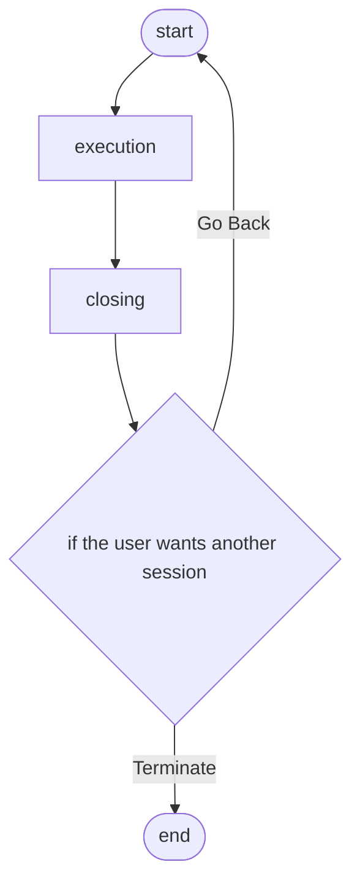

# Hit and Blow

A terminal-based "Hit and Blow" (Mastermind-style) number guessing game, built as a hands-on project for learning Node.js development with TypeScript.

## Objective

- Get hands-on experience with Node.js + TypeScript development
- Learn TypeScript's basic syntax and paradigms by building a small but complete game

## How to Play

1. The game generates a secret code made of unique digits (e.g. 3 digits, each from 0–9).
2. You repeatedly guess a code of the same length.
3. After each guess, the game tells you:
   - **Hit** — number of digits that are correct *and* in the correct position
   - **Blow** — number of digits that are correct but in the *wrong* position
4. Keep guessing until you get all hits (you win) or you run out of attempts (you lose).
5. After the game ends, you can choose to play again or quit.

## Game Flow



## Getting Started

### Prerequisites

- [Node.js](https://nodejs.org/) (with npm)

### Install dependencies

```bash
npm install
```

### Build

Compile TypeScript to JavaScript (output goes to `dist/`):

```bash
npm run build
```

### Run in watch mode (rebuild on changes)

```bash
npm run dev
```

### Play

After building, run the compiled game:

```bash
node dist/index.js
```

## Project Structure

```
hit_and_blow/
├── specs/
│   ├── design.md               # Game architecture & flow
│   └── implementation-plan.md  # Step-by-step build plan
├── src/
│   ├── types.ts                # Shared type/interface definitions
│   ├── generateSecret.ts       # Secret code generator
│   ├── judge.ts                # Hit/Blow comparison logic
│   ├── input.ts                # Terminal input handling
│   ├── game.ts                 # Main game loop
│   └── index.ts                # Entry point
├── tsconfig.json               # TypeScript compiler configuration
└── package.json
```

## Learning Notes

This project is structured to introduce TypeScript concepts incrementally — see [`specs/implementation-plan.md`](./specs/implementation-plan.md) for the staged build plan, including which TypeScript concepts (types/interfaces, async/await, unions, generics, etc.) each file is meant to illustrate.
