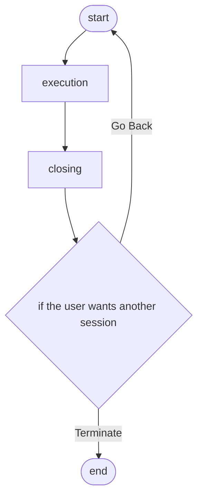
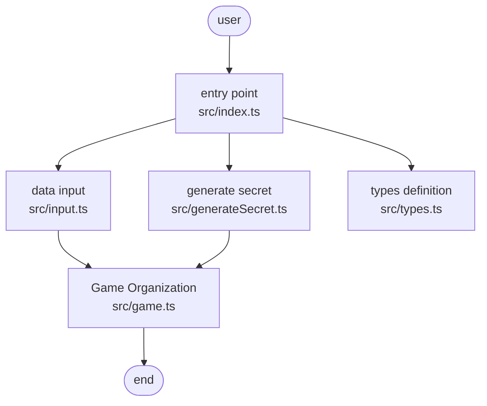

# Hit and Blow Application Architecture

## Objective

- Get a hands-on experience of development by Node JS with TypeScript.
- Make a hit and blow game
- Learn basic TypeScript's syntax and paradigm

## Game Flow

## System Architecture

